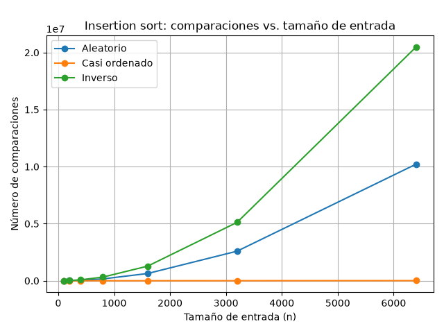
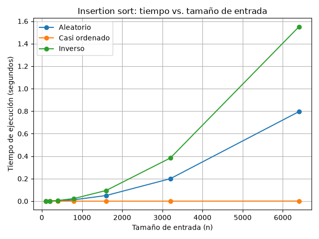
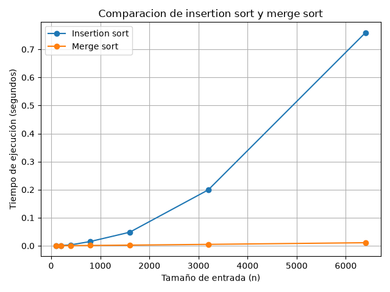

# Laboratorio 1 - Complejidad y Recurrencia

## Contexto del problema

La base de datos de salud **Tamiza**, operada por una Secretaría de Salud Departamental, contiene aproximadamente 1.2 millones de exámenes de salud los cuales incluyen los exámenes cardiovasculares. Cada entrada consiste en un índice de riesgo que va de 0 a 1000 el cual debe ordenarse de mayor a menor en orden descendente durante la noche, desde las 2:00 a.m. hasta las 6:00 a.m.

Actualmente la base de datos utiliza **Insertion sort**,un algoritmo que ha estado funcionando por algunos años pero actualmente está teniendo dificultades para completar el ordenamiento dentro del tiempo de procesamiento especificado debido al aumento en la cantidad de datos. Como una posible solución la infraestructura está considerando duplicar la velocidad del servidor.

Esto se está probando en el laboratorio a través del estudio de la complejidad de insertion sort, sus distintos tipos de entradas y su evaluación experimental cuando se compara con merge sort.

Los escenarios utilizados son:

- **Escenario A — Aleatorio:** Los registros se introducen sin ninguna relación específica con el índice de riesgo.
- **Escenario B — Casi ordenado:** El 98% de los registros están casi ordenados mientras que el 2% restante son nuevos registros.
- **Escenario C — Inverso:** los registros llegan ordenados de menor a mayor, exactamente contrario al orden requerido.

---

# Parte 1 — Corrección y eficiencia

Un algoritmo puede ser correcto y, al mismo tiempo, resultar ineficiente para un problema de gran tamaño. La corrección indica que el algoritmo produce el resultado esperado. La eficiencia por otro lado implica evaluar el uso de los recursos utilizados en el proceso de generar la salida requerida, especialmente el tiempo y la memoria.

En cuanto al algoritmo de Tamiza, el insertion sort sería capaz de dar los registros ordenados empezando desde el registro más grande hasta el más pequeño. La complejidad del algoritmo depende fuertemente del ordenamiento de los datos. El mejor de los casos es \(Θ(n)\) mientras que el caso promedio y el peor es \(Θ(n^2)\). Cuando el número de registros aumenta considerablemente, el número de operaciones puede crecer mucho más rápido que el tamaño de la entrada.

Este caso en particular tiene una importancia especial debido a la restricción que se le ha impuesto a Tamiza: todo el procesamiento tiene que hacerse en solo cuatro horas. No basta con que el algoritmo finalmente dé la salida correcta; el procesamiento también tiene que hacerse dentro del marco de tiempo disponible.

Duplicar la velocidad del servidor podría disminuir el tiempo de ejecución bajo condiciones ideales, pero solamente representa una mejora constante del hardware. La complejidad del algoritmo seguiría siendo \(Θ(n^2)\), por lo que el problema fundamental permanecería cuando el volumen de datos continúe aumentando.

Un ejemplo similar puede observarse al buscar información en una lista grande utilizando una búsqueda secuencial. Aunque funciona correctamente, revisar los elementos uno por uno puede ser demasiado costoso cuando la cantidad de datos aumenta. Si los datos están ordenados y es posible utilizar búsqueda binaria, puede reducirse considerablemente el número de operaciones. Por tanto, mejorar el algoritmo puede ser más importante que aumentar únicamente la capacidad del hardware.

---

# Parte 2 — Responsabilidad ambiental y ética

La selección de un algoritmo para un sistema de salud no puede basarse únicamente en si el algoritmo produce la salida correcta. Es esencial evaluar la utilización de los recursos y los efectos que pueda tener su implementación repetitiva.

En Tamiza el procesamiento de datos se realiza dentro de un lapso de cuatro horas por la noche. Si la tasa de crecimiento del algoritmo es muy alta puede requerir muchas más operaciones para completar la misma tarea ya que el tamaño de los datos crece. Esto puede resultar en un aumento de la carga de trabajo del procesador y por ende el poder consumido por los servidores.

Uno de los resultados más directos será **el aumento del consumo de energía** el cual es pagado directamente por la empresa que maneja la infraestructura y de manera indirecta por los fondos públicos que se destinan al funcionamiento del servicio. También hay un efecto en el medio ambiente en cuanto a la energía consumida por el equipo.

Otro problema que surge de los problemas con la eficiencia computacional es la **posibilidad de no completar el proceso dentro del plazo estipulado**. Los resultados obtenidos a través de la computación podrían no estar listos a tiempo para ser utilizados para las operaciones posteriores que realizan los servicios de salud. En esta situación el costo será asumido por la propia organización, por las personas que trabajan allí y potencialmente por los que se benefician del sistema.

Es importante darse cuenta sin embargo que el ordenamiento de los registros no es solamente un proceso tecnológico. Si los registros son ordenados por sus niveles de riesgo y el orden determina a las personas que deben ser contactadas primero, la eficiencia del proceso tiene un impacto directo en la calidad de la atención médica que el sistema está supuesto a brindar.

Por eso la responsabilidad técnica del proceso debería involucrar la eficiencia computacional y la gestión adecuada de los recursos también.

---

# Parte 3 — Casos de insertion sort

## 3.1 Análisis teórico

### Mejor caso

El mejor caso ocurre cuando los datos ya están ordenados de mayor a menor, que es el orden requerido por Tamiza. Cada nuevo elemento necesita solamente una comparación con el elemento anterior antes de continuar.

Para una entrada de tamaño \(n\), se realizan aproximadamente:

$$
n-1
$$

comparaciones.

Por lo tanto:

$$
\boxed{T(n)=Θ(n)}
$$

### Peor caso

El peor caso ocurre cuando los datos están ordenados de menor a mayor. Cada elemento debe desplazarse frente a todos los elementos anteriores.

El número de comparaciones corresponde a:

$$
1+2+3+\cdots +(n-1)
$$

que puede expresarse como:

$$
\frac{n(n-1)}{2}
$$

Por lo tanto:

$$
\boxed{T(n)=Θ(n^2)}
$$

### Caso promedio

El caso promedio representa el comportamiento esperado sobre las diferentes entradas posibles de un tamaño determinado, bajo una distribución definida. En este laboratorio se utiliza el escenario aleatorio como una aproximación experimental.

Para insertion sort, el comportamiento promedio es:

$$
\boxed{T(n)=Θ(n^2)}
$$

### Predicción

Antes de ejecutar el experimento se esperaba:

- **Escenario A:** comportamiento cercano al caso promedio.
- **Escenario B:** comportamiento cercano al mejor caso.
- **Escenario C:** comportamiento correspondiente al peor caso.

Los resultados experimentales permitieron comprobar esta predicción.

---

## 3.2 Implementación

La implementación instrumentada de insertion sort se encuentra en:

[`algoritmos.py`](algoritmos.py)

Los generadores de los tres escenarios se encuentran en:

[`datos.py`](datos.py)

El experimento de la Parte 3 se encuentra en:

[`parte3_casos.py`](parte3_casos.py)

---

## 3.3 Resultados experimentales

Se utilizaron los tamaños:

$$
100,\ 200,\ 400,\ 800,\ 1600,\ 3200,\ 6400
$$

Para cada tamaño se realizaron tres mediciones y se utilizó el tiempo promedio obtenido mediante `time.perf_counter()`.

### Comparaciones

La gráfica muestra una diferencia clara entre los escenarios. El caso inverso presenta un crecimiento cuadrático y alcanza exactamente:

$$
\frac{6400(6399)}{2}=20.476.800
$$

comparaciones para \(n=6400\).

El escenario casi ordenado requiere muchas menos comparaciones, mientras que el escenario aleatorio presenta un comportamiento intermedio.

### Tiempo de ejecución

Los tiempos confirman la relación observada en el número de comparaciones. Para \(n=6400\), el escenario casi ordenado tardó aproximadamente 0,001019 s, el escenario aleatorio 0,795671 s y el escenario inverso 1,549834 s.

Esto evidencia que el rendimiento de insertion sort depende fuertemente de la distribución de los datos y que su peor caso puede representar un problema cuando el volumen de registros es grande.

---

# Parte 4 — Merge sort

## 4.1 Complejidad mediante recurrencia

Merge sort divide el problema en dos subproblemas de tamaño aproximadamente \(n/2\) y posteriormente mezcla sus resultados.

La recurrencia es:

$$
T(n)=2T(n/2)+Θ(n)
$$

Aplicando el **Teorema Maestro**:

$$
a=2,\qquad b=2,\qquad f(n)=Θ(n)
$$

Además:

$$
n^{\log_b a}
=
n^{\log_2 2}
=
n
$$

Por lo tanto:

$$
f(n)=Θ(n^{\log_b a})
$$

y corresponde al caso 2 del Teorema Maestro.

Así:

$$
\boxed{T(n)=Θ(n\log n)}
$$

---

## 4.2 Análisis línea por línea de insertion sort

La implementación realiza primero una copia de la entrada, con un costo lineal \(Θ(n)\). Después recorre los elementos desde la segunda posición.

En cada iteración se obtiene la clave y se establece la posición inicial para realizar las comparaciones. El costo de estas operaciones es lineal en relación con el número de elementos.

El comportamiento determinante está en el ciclo `while`.

En el mejor caso, cada elemento necesita una sola comparación:

$$
n-1
$$

Por tanto, el trabajo del ciclo interno es \(Θ(n)\), y el costo total es:

$$
\boxed{Θ(n)}
$$

En el peor caso, el ciclo interno debe recorrer progresivamente una cantidad mayor de elementos:

$$
1+2+3+\cdots +(n-1)
=
\frac{n(n-1)}{2}
$$

Este término es cuadrático, por lo que domina los demás costos:

$$
\boxed{Θ(n^2)}
$$

El caso promedio también presenta comportamiento cuadrático:

$$
\boxed{Θ(n^2)}
$$

### Tabla de complejidad

| Algoritmo      |     Mejor caso |  Caso promedio |      Peor caso |
| -------------- | -------------: | -------------: | -------------: |
| Insertion sort |       \(Θ(n)\) |     \(Θ(n^2)\) |     \(Θ(n^2)\) |
| Merge sort     | \(Θ(n\log n)\) | \(Θ(n\log n)\) | \(Θ(n\log n)\) |

---

## 4.3 Comparación experimental

Para esta comparación se utilizó el escenario A, correspondiente a una entrada aleatoria, y los mismos tamaños utilizados en la Parte 3.

El experimento se encuentra en:

[`parte4_complejidad.py`](parte4_complejidad.py)

Los resultados obtenidos fueron:

| Tamaño | Insertion sort (s) | Merge sort (s) |
| -----: | -----------------: | -------------: |
|    100 |           0,000195 |       0,000125 |
|    200 |           0,000977 |       0,000341 |
|    400 |           0,003216 |       0,000591 |
|    800 |           0,015421 |       0,001214 |
|   1600 |           0,048355 |       0,002451 |
|   3200 |           0,199282 |       0,005101 |
|   6400 |           0,759098 |       0,010954 |

Para \(n=6400\), insertion sort tardó aproximadamente 0,759098 s, mientras que merge sort tardó 0,010954 s. En esta medición concreta, insertion sort tardó aproximadamente 69 veces más.

La diferencia aumenta conforme crece el tamaño de entrada, lo cual coincide con las complejidades teóricas de ambos algoritmos.

---

## 4.4 Concepto técnico final

Basándose en un análisis teórico así como en los resultados de los experimentos se sugiere utilizar el algoritmo merge sort en lugar del algoritmo de insertion sort en el proceso de ordenamiento de los registros de Tamiza. Esta sugerencia se hace teniendo en cuenta el rendimiento de ambos algoritmos en términos de sus complejidades. Mientras que el algoritmo de ordenamiento por inserción tiene una complejidad de \(Θ(n^2)\) el algoritmo de ordenamiento por fusión tiene una complejidad de \(Θ(n\log n)\).

Los tres escenarios analizados muestran que el comportamiento de insertion sort depende considerablemente de la distribución de los datos. En el escenario casi ordenado su rendimiento se aproxima al mejor caso, pero en el escenario inverso alcanza el peor caso. El escenario aleatorio, utilizado como aproximación experimental al caso promedio, mostró un crecimiento considerable del tiempo conforme aumentó el tamaño de entrada. Esto representa un riesgo para Tamiza, debido a que el proceso debe completarse dentro de una ventana estricta de cuatro horas.

La comparación experimental entre ambos algoritmos confirma esta diferencia. Con 6.400 elementos, insertion sort tardó 0,759098 segundos, mientras que merge sort tardó 0,010954 segundos en el escenario aleatorio. En esta medición, insertion sort necesitó aproximadamente 69 veces más tiempo. Aunque estos valores dependen del equipo y de las condiciones de ejecución, la tendencia coincide con el análisis de complejidad y muestra que la diferencia aumenta a medida que crece la entrada.

Para los 1.200.000 registros de Tamiza, los tiempos exactos no pueden obtenerse simplemente prolongando linealmente las mediciones, ya que el comportamiento depende de la complejidad del algoritmo y de las condiciones reales de ejecución. Sin embargo, la diferencia entre \(Θ(n^2)\) y \(Θ(n\log n)\) permite establecer que el crecimiento de insertion sort será mucho más costoso a esa escala. Esta consideración corresponde a una extrapolación teórica y no a una medición real del sistema de producción.

Duplicar la velocidad del servidor podría reducir el tiempo de ejecución aproximadamente por un factor constante bajo condiciones ideales, pero no modifica la complejidad del algoritmo. Si el problema continúa creciendo, insertion sort seguirá presentando un crecimiento cuadrático. Por ello, aumentar el hardware puede ser una medida temporal, pero no reemplaza la necesidad de utilizar un algoritmo con mejor comportamiento asintótico.

Además del tiempo de ejecución, debe considerarse el consumo de recursos. Un algoritmo que requiere más operaciones para procesar los mismos datos puede implicar un mayor uso de CPU y energía durante las ejecuciones nocturnas. En un sistema que procesa grandes volúmenes de información de manera recurrente, esta diferencia también puede representar un costo operativo y ambiental. Por estas razones, la selección del algoritmo debe considerar tanto el tiempo como el uso eficiente de los recursos disponibles.

---

# Conclusiones

El laboratorio permitió relacionar el análisis teórico de complejidad con resultados obtenidos experimentalmente. Los casos de insertion sort demostraron que el rendimiento puede cambiar considerablemente según la distribución de los datos, especialmente cuando se presenta el peor caso.

La comparación con merge sort mostró que una diferencia en la complejidad asintótica se vuelve cada vez más importante a medida que aumenta el tamaño de entrada. Los resultados obtenidos con 6.400 elementos fueron consistentes con el comportamiento esperado de \(Θ(n^2)\) para insertion sort y \(Θ(n\log n)\) para merge sort.

Finalmente, el análisis evidencia que aumentar únicamente la capacidad del hardware no resuelve el crecimiento algorítmico del problema. Para una plataforma como Tamiza, que debe procesar un volumen elevado de registros dentro de una ventana temporal estricta, el diseño del algoritmo debe considerar simultáneamente corrección, tiempo de ejecución y uso responsable de los recursos.

---

# Referencias

- Cormen, T. H., Leiserson, C. E., Rivest, R. L., & Stein, C. _Introduction to Algorithms_. MIT Press.
- Sedgewick, R., & Wayne, K. _Algorithms_. Addison-Wesley.
- Python Software Foundation. _Python Documentation — `time.perf_counter()`_.
